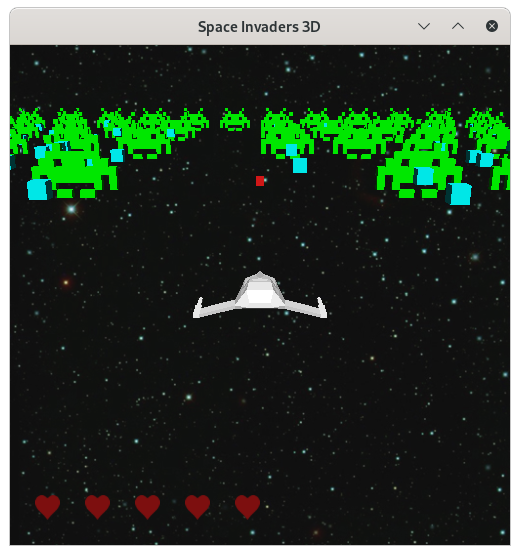

# Space Invaders

Welcome to my SpaceInvaders Clone. I created this application as an educational project at the [Hochschule
Ravensburg-Weingarten](https://www.rwu.de/).

## Screenshots




## How to play

* `Spacebar` Shot
* `🠔` Move left
* `➞` Move right
* `🠕` Special Shot
* `ESC` Exit Game
* `f` Full Screen
* `r` Restart Game
* `m` Switch Polygon Mode

## Build and Play

### Debian

```
$ apt install cmake build-essential mesa-common-dev freeglut3-dev libglew-dev libglm-dev libsoil-dev libxmu-dev libxi-dev
$ ./build.sh
$ ./build/spaceinvaders
```

### Fedora

```
$ dnf install cmake gcc-c++ mesa-libGL-devel mesa-libGLU-devel freeglut-devel glew-devel glm-devel SOIL-devel
$ ./build.sh
$ ./build/spaceinvaders
```
